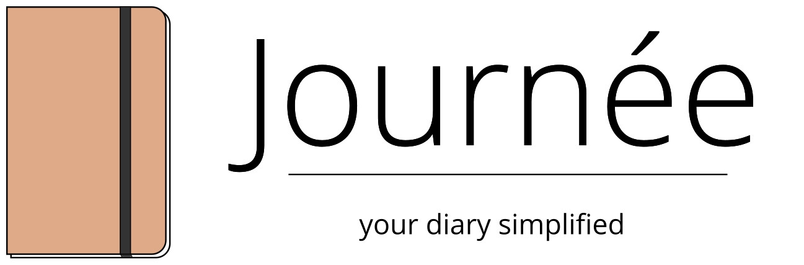
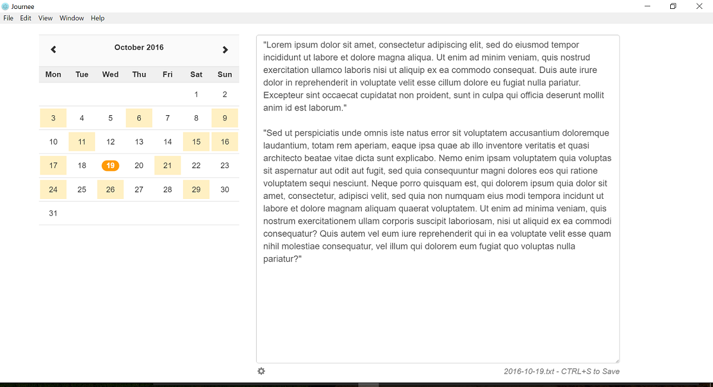

# journee (beta)

A lightweight, simplified RedNotebook-type journal/diary app. Built with Electron. Makes a folder full of dated text files.



### Installing and Running

Make sure you have electron installed globally
```
npm install -g electron
```

then install dependencies and run

```
npm install
electron .
```

### Journee works great... but it's just getting started. (This is beta!)

#### Things still coming:

- Search function
- Keyboard Shortcuts and explanations
- Logos/icons finished and proper packaging 
- Polished up UI

#### Contributions are welcome!

Made by Adam Dueck - Apache 2.0 Licence

Built using [Bootstrap](https://getbootstrap.com), [Zabuto Calendar](https://github.com/zabuto/calendar), [NodeJS](https://nodejs.org), and [Electron](electron.atom.io).
